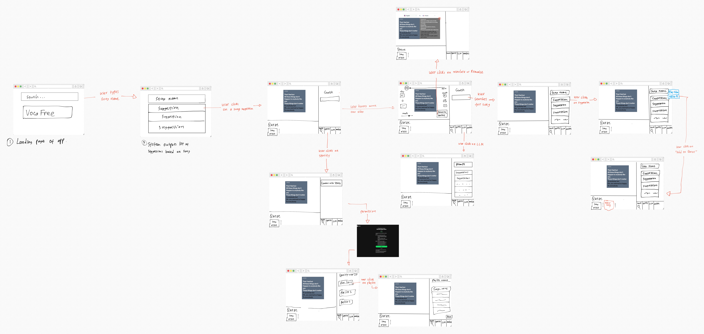

# VocaFree
**VocaFree** is a web application designed to enhance your karaoke experience by letting you remove vocals from any song, leaving just the instrumental track. Powered by the Genius API, it also allows you to search for and display lyrics or find a song based on a snippet of lyrics you remember. VocaFree provides detailed song and artist information, making it a tool for music discovery. 

In addition, the app integrates with the OpenAI API to translate lyrics into different languages, helping you understand songs from around the world. You can get personalized song recommendations based on prompts or themes, and for non-English songs, VocaFree offers phonetic translations so you can sing along even without knowing the language. The app also features basic lyric analysis, providing insights and themes from your favorite tracks for a deeper musical connection. 

## Group members
- An Luu (301574874)
- Parsa Ghaderi (301623337)
- Jake Choi (301552446)
- Caiden Merklin (301608302)

## Link to Project Proposal Report
[Link to Project Proposal Report](docs/proposal/CMPT_276_Milestone_1_Group_07_Hills_Proposal_Report.pdf)

## AI Disclosure Forms
- [An](docs/ai_disclosure_forms/M1/M1_AI_Declaration_An_Luu_301574874.pdf)
- [Parsa](docs/ai_disclosure_forms/M1/M1_AI_Declaration_MohamadParsa_Ghaderi_301623337.pdf)
- [Jake](docs/ai_disclosure_forms/M1/M1_AI_Declaration_Jake_Choi_301552446.pdf)
- [Caiden](docs/ai_disclosure_forms/M1/M1_AI_Declaration_Caiden_Merklin_301608302.pdf)

## User Interface Storyboard

